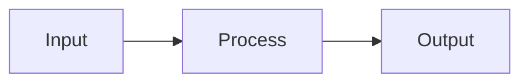

# Slidev Component Catalog

Reusable CSS component classes and their HTML structure for building slides. All classes are
defined in `style.css` and available globally.

## Cards

### Two-column cards

```html
<div class="two-cards">
  <div class="info-card">
    <div class="card-title">Card Title</div>
    <div class="card-desc">Description text explaining this card's content.</div>
  </div>
  <div class="info-card">
    <div class="card-title">Card Title</div>
    <div class="card-desc">Description text explaining this card's content.</div>
  </div>
</div>
```

### Three-column cards

```html
<div class="three-cards">
  <div class="info-card">
    <div class="card-title">Title</div>
    <div class="card-desc">Description.</div>
  </div>
  <div class="info-card">
    <div class="card-title">Title</div>
    <div class="card-desc">Description.</div>
  </div>
  <div class="info-card">
    <div class="card-title">Title</div>
    <div class="card-desc">Description.</div>
  </div>
</div>
```

### Cards with icons

Use Phosphor icons (`weight="thin"`) inside cards:

```html
<script setup>
import { PhSparkle, PhBookOpen, PhGear } from '@phosphor-icons/vue'
</script>

<div class="three-cards">
  <div class="info-card">
    <PhSparkle :size="48" weight="thin" class="card-icon" />
    <div class="card-title">Title</div>
    <div class="card-desc">Description.</div>
  </div>
  <!-- more cards -->
</div>
```

## Ladder (Numbered Steps)

Ordered steps with large orange numbers. **Max 3-4 items per slide** to prevent overflow.

```html
<div class="ladder">
  <div class="ladder-step">
    <div class="ladder-num">1</div>
    <div class="ladder-content">
      <div class="ladder-title">Step Title</div>
      <div class="ladder-desc">Brief explanation of this step.</div>
    </div>
  </div>
  <div class="ladder-step">
    <div class="ladder-num">2</div>
    <div class="ladder-content">
      <div class="ladder-title">Step Title</div>
      <div class="ladder-desc">Brief explanation of this step.</div>
    </div>
  </div>
  <div class="ladder-step">
    <div class="ladder-num">3</div>
    <div class="ladder-content">
      <div class="ladder-title">Step Title</div>
      <div class="ladder-desc">Brief explanation of this step.</div>
    </div>
  </div>
</div>
```

### Compact ladder (4 items)

When you need 4 items, reduce spacing to prevent overflow:

```html
<div class="ladder" style="gap: 0;">
  <div class="ladder-step" style="padding: 0.45rem 0;">
    <div class="ladder-num" style="font-size: 2rem;">1</div>
    <div class="ladder-content">
      <div class="ladder-title" style="font-size: 1.05rem;">Step Title</div>
      <div class="ladder-desc" style="font-size: 0.85rem;">Brief explanation.</div>
    </div>
  </div>
  <!-- repeat for steps 2-4 -->
</div>
```

## Reuse Grid (Two-Column Categorized Lists)

Good for showing "what we keep" vs "what's new" or similar categorized items.

```html
<div class="reuse-grid">
  <div class="reuse-column green">
    <h3>Reused</h3>
    <div class="reuse-item">Workflow Engine</div>
    <div class="reuse-item">Tool System</div>
    <div class="reuse-item">Configuration Tables</div>
  </div>
  <div class="reuse-column blue">
    <h3>New</h3>
    <div class="reuse-item">Chat Agent Runtime</div>
    <div class="reuse-item">Message Buffering</div>
    <div class="reuse-item">WhatsApp Integration</div>
  </div>
</div>
```

Color variants: `green` (reused/existing), `blue` (new/added).

## Comparison Table

For side-by-side feature or option comparisons. **Max 7 rows** to prevent overflow.

```html
<table class="comparison-table">
  <thead>
    <tr><th>Aspect</th><th>Option A</th><th>Option B</th></tr>
  </thead>
  <tbody>
    <tr><td>Deployment</td><td>Two runtimes</td><td>One runtime</td></tr>
    <tr><td>Complexity</td><td>Higher</td><td>Lower</td></tr>
    <tr><td>Scalability</td><td>Independent</td><td>Shared</td></tr>
  </tbody>
</table>
```

First column is automatically bold. Headers are uppercase with letter spacing.

## Infrastructure Table

Compact table for listing AWS resources or infrastructure components.

```html
<table class="infra-table">
  <thead>
    <tr><th>Resource</th><th>Type</th><th>Purpose</th></tr>
  </thead>
  <tbody>
    <tr><td>Buffer Table</td><td>DynamoDB</td><td>Message aggregation</td></tr>
    <tr><td>Handler</td><td>Lambda</td><td>Parse webhooks</td></tr>
    <tr><td>State Machine</td><td>Step Functions</td><td>Message buffering</td></tr>
  </tbody>
</table>
```

Smaller font than comparison-table. First column is semi-bold.

## Pros / Cons

Two-column layout for advantages and disadvantages.

```html
<div class="pros-cons">
  <div class="pros">
    <h3>Advantages</h3>
    <ul>
      <li>Clean separation of concerns</li>
      <li>Independent scaling</li>
      <li>Future reusability</li>
    </ul>
  </div>
  <div class="cons">
    <h3>Trade-offs</h3>
    <ul>
      <li>Additional infrastructure</li>
      <li>Extra network hop</li>
    </ul>
  </div>
</div>
```

Pros header is green, cons header is red. Orange bullet markers are automatically hidden
inside pros/cons containers.

## Big Quote

Centered, large-format quote for emphasis slides. Use with `layout: center`.

```html
<div class="big-quote">
  The key insight is that
  <span class="accent">message buffering</span>
  changes the entire user experience.
</div>
```

The `.accent` span renders in orange.

## Section Divider

Use as a CSS class on the slide, not as HTML. Large centered section headers.

```markdown
---
class: section-divider
---

## Section Title
<p class="byline">Brief section description</p>
```

## Appendix Divider

Marks the start of appendix slides. Renders with reduced opacity.

```markdown
---
class: appendix-divider vcenter
---

## Appendix
<p class="byline">Reference material</p>
```

## SVG Flow Diagrams

For custom architecture or flow diagrams. **Critical**: always set `font-size: 1px` on the
`<svg>` element and use inline `style` on every `<text>` element.

```html
<svg viewBox="0 0 900 160" xmlns="http://www.w3.org/2000/svg"
     class="flow-diagram"
     style="width: 100%; margin: 1rem 0; font-size: 1px;">
  <!-- Background box -->
  <rect x="10" y="20" width="160" height="60" rx="6"
        fill="rgba(46,125,50,0.08)" stroke="#2E7D32" stroke-width="1.5"/>
  <!-- Label -->
  <text x="90" y="55" text-anchor="middle"
        style="font-size: 14px; font-weight: 700;"
        fill="#161D26">Component</text>
  <!-- Arrow -->
  <line x1="170" y1="50" x2="230" y2="50"
        stroke="#232F3E" stroke-width="1.5" marker-end="url(#arrow)"/>
</svg>
```

### Color coding for diagram boxes

| Meaning | Fill | Stroke |
|---------|------|--------|
| Existing / reused | `rgba(46,125,50,0.08)` | `#2E7D32` (green) |
| New component | `rgba(21,101,192,0.08)` | `#1565C0` (blue) |
| External / managed | `rgba(255,152,0,0.1)` | `#FF9800` (yellow) |
| Error / warning | `rgba(211,47,47,0.06)` | `#D32F2F` (red) |

Always include a legend when using color coding in a diagram.

## Mermaid Diagrams

Use with scale parameter for fit. Prefer `LR` (left-right) layout.

````markdown

````

Keep node labels short (2-3 words max). If the diagram is still too large, reduce scale
further (0.35-0.4) or split across two slides.
