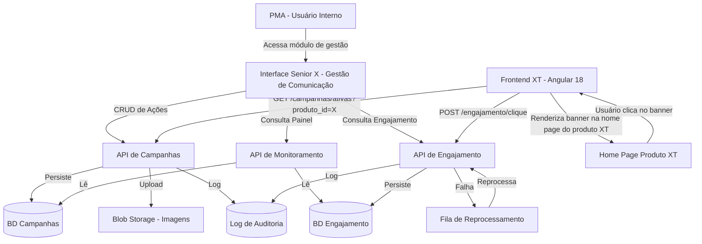
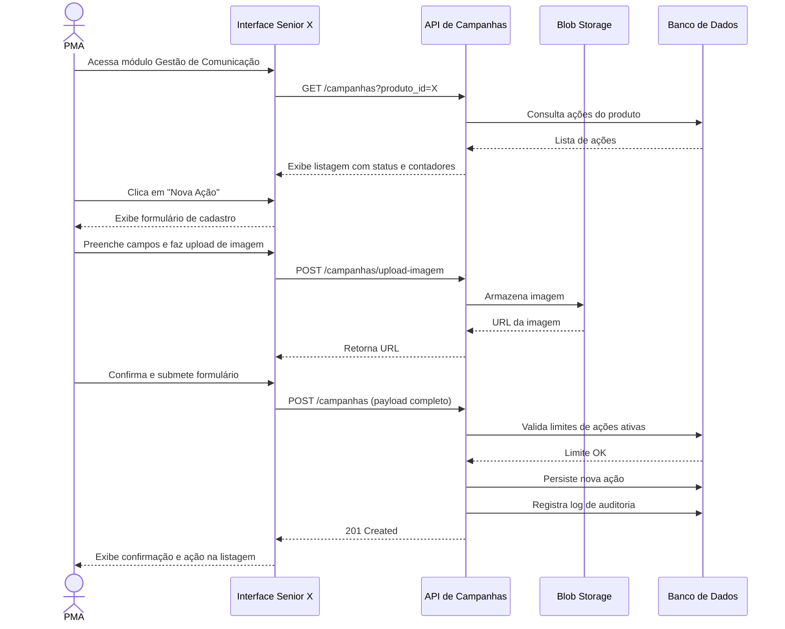

# PRD — Gestão de Comunicação via Produto

## Metadados do Documento

| Campo | Valor |
|---|---|
| Produto / Módulo | Senior X — Plataforma de Gestão |
| Funcionalidade | Gestão de Comunicação via Produto |
| Tipo | Novo produto |
| Direcionador Estratégico | Cobertura / Inovação |
| Status | Em Definição |
| Product Owner | Necessário validar |
| Stakeholders | PMAs, Time de Produto, Engenharia, UX, CS |
| Data de criação | Necessário validar |
| Última atualização | Necessário validar |
| Versão | v0.1 |

---

## 1. Visão do Produto

**O que é?**
Gestão de Comunicação via Produto é um módulo nativo da plataforma Senior X que permite que PMAs (Product Marketing Analysts) cadastrem, gerenciem e monitorem campanhas de comunicação visual — banners com links — diretamente pela interface do produto, sem necessidade de acesso ao código-fonte.

**Para quem?**
PMAs e times de produto da Senior Sistemas responsáveis por comunicar novidades, promoções e ações de upsell aos usuários finais da plataforma.

**Qual o valor entregue?**
Autonomia operacional para o time de marketing de produto: campanhas publicadas em minutos, sem dependência de desenvolvimento, com rastreabilidade de engajamento em tempo real.

**Resumo executivo:**
Hoje, qualquer alteração de banner ou link comunicativo na home page dos produtos XT exige intervenção direta no código-fonte do workspace — um gargalo que atrasa campanhas, aumenta o risco de erros e cria dependência crítica do time de engenharia para ações de marketing. Este módulo elimina esse gargalo ao entregar uma interface de gestão self-service para campanhas visuais, com controle de limites por tipo de produto (gratuito/upsell), monitoramento de engajamento e filtros avançados. O resultado é um ciclo de comunicação mais ágil, mensurável e seguro.

---

## 2. Problema e Evidências

### 2.1 Estado Atual (As-Is)

Atualmente, a inserção ou alteração de imagens e links de comunicação na home page dos produtos XT é feita diretamente no código-fonte do workspace. O processo exige:

1. PMA identifica necessidade de campanha e elabora o material visual.
2. PMA abre chamado ou solicita ao time de desenvolvimento a alteração no código.
3. Desenvolvedor acessa o código-fonte, localiza o ponto de inserção e realiza a alteração.
4. Alteração passa por processo de revisão e deploy.
5. Campanha vai ao ar — com atraso médio de dias a semanas.

Não há interface de monitoramento de cliques ou engajamento associada a essas ações. O PMA não tem visibilidade sobre o desempenho das campanhas publicadas.

### 2.2 Evidências de Dor

| Fonte da Evidência | Descrição |
|---|---|
| Processo atual mapeado | Dependência do time de desenvolvimento para publicar qualquer campanha visual |
| Ausência de dados | Nenhum mecanismo de rastreamento de cliques nas campanhas atuais |
| Velocidade de mercado | Campanhas que deveriam durar dias levam semanas para ir ao ar |
| Risco operacional | Alterações manuais no código aumentam risco de regressão e indisponibilidade |
| Dados internos | Necessário validar: volume de chamados do time de desenvolvimento originados por solicitações de marketing |

> ⚠️ **Lacuna:** Não foram fornecidos dados quantitativos (volume de chamados, tempo médio de publicação, NPS de PMAs). Recomenda-se levantar esses dados antes da aprovação final do PRD.

### 2.3 Benchmark — Ferramentas Internas de Gestão de Comunicação In-Product

> **Contexto importante:** Este módulo é para uso **interno da Senior Sistemas** pelos PMAs — não é um produto vendido a clientes. O benchmark correto é com ferramentas que times internos de marketing de produto usam para gerenciar banners, comunicados e campanhas dentro de plataformas SaaS/ERP. A comparação com TOTVS, Sankhya, Benner e LG não se aplica aqui, pois são concorrentes de mercado no produto final, não referências para a ferramenta interna.

| Referência | Tipo | Funcionalidade Observada | Pontos Fortes | Pontos Fracos |
|---|---|---|---|---|
| **Intercom Product Tours** | Ferramenta SaaS de comunicação in-product | Criação e gestão de banners, tooltips e modais diretamente na interface do produto, com segmentação e analytics de engajamento | Self-service completo para times de produto/marketing; analytics nativo de cliques e conversão; controle de exibição por segmento | Produto externo (não nativo); custo adicional de licença; integração necessária |
| **Pendo** | Plataforma de adoção de produto | Gestão de guias, banners e comunicados in-app com rastreamento de engajamento e segmentação por perfil de usuário | Analytics avançado; segmentação granular; sem dependência de engenharia para publicar | Produto externo; complexidade de implementação; custo elevado |
| **Appcues** | Ferramenta de onboarding e comunicação in-product | Editor visual de banners e flows sem código, com métricas de engajamento | Editor no-code; fácil adoção por PMAs; integração com ferramentas de analytics | Produto externo; sem controle nativo de limites por tipo de produto |
| **Solução atual (código-fonte)** | Processo interno manual | Alteração direta no código-fonte do workspace para inserir/alterar banners | Nenhum custo de ferramenta adicional | Dependência total do time de desenvolvimento; sem rastreamento; lento; alto risco operacional |

**Oportunidades de diferenciação em relação às ferramentas externas:**
- Ferramentas como Intercom, Pendo e Appcues são produtos externos com custo de licença e integração. Uma solução **nativa na plataforma Senior X** elimina esse custo e garante integração perfeita com o modelo de autenticação, produtos e workspaces já existentes.
- O controle de **limite de ações ativas por tipo de produto (gratuito vs. upsell)** é uma regra de negócio específica da Senior — nenhuma ferramenta externa implementa essa lógica nativamente.
- A solução interna permite **rastreabilidade total** dentro do ecossistema Senior, sem dependência de terceiros para dados de engajamento.

> ⚠️ **Lacuna estratégica:** Avaliar se o investimento em desenvolvimento interno é mais vantajoso do que adotar uma ferramenta externa (ex: Pendo ou Intercom) com integração via API. Essa decisão de build vs. buy deve ser validada com time de produto e financeiro antes do início do desenvolvimento.


---

## 3. Objetivos de Negócio

| # | Objetivo | Métrica Alvo | Prazo |
|---|---|---|---|
| O1 | Eliminar dependência do time de desenvolvimento para publicação de campanhas | 100% das campanhas publicadas via interface (0 chamados de desenvolvimento para banners) | 3 meses após release |
| O2 | Reduzir tempo de publicação de campanhas | Tempo médio de publicação < 30 minutos (vs. dias/semanas atual) | 3 meses após release |
| O3 | Gerar dados de engajamento para decisões de marketing | 100% das ações com rastreamento de cliques ativo | Desde o release |
| O4 | Aumentar adoção do módulo pelos PMAs | Necessário validar: % da base de PMAs usando o módulo ativamente | 6 meses após release |
| O5 | Reduzir risco operacional de alterações manuais no código | 0 incidentes de regressão originados por alterações de banner | 3 meses após release |

> ⚠️ **Lacuna:** Baseline atual (tempo médio de publicação, volume de chamados) precisa ser levantado para tornar as metas mensuráveis.

---

## 4. Custos e Investimento

> **Nota:** Este é um produto de uso **interno da Senior Sistemas** — não é vendido a clientes. Não há modelo de pricing externo. A análise aqui é de custo de desenvolvimento e operação.

| Item | Descrição |
|---|---|
| Custo de desenvolvimento | Necessário estimar com engenharia (backend, frontend, infraestrutura) |
| Custo de infraestrutura | Blob storage para imagens, banco de dados de eventos de clique, fila de mensageria, cache |
| Custo de manutenção | Job de expiração automática, monitoramento de fila, logs de auditoria |
| ROI esperado | Eliminação de horas do time de desenvolvimento gastas em alterações manuais de banner; redução de risco operacional; habilitação de campanhas de upsell mensuráveis |
| Decisão build vs. buy | Avaliar custo de desenvolvimento interno vs. licença de ferramenta externa (ex: Pendo ~$X/mês — necessário validar cotação) |

> ⚠️ **Lacuna:** Necessário levantar estimativa de horas do time de desenvolvimento atualmente gastas em alterações de banner para calcular o ROI real da solução interna vs. ferramenta externa.

---

## 5. Personas

> **Contexto:** As personas são **internas à Senior Sistemas** (quem usa a ferramenta de gestão) e **usuários finais dos produtos XT** (quem vê as campanhas publicadas na home page).

| Persona | Perfil | Necessidade Principal | Valor Recebido |
|---|---|---|---|
| **PMA (Product Marketing Analyst)** | Colaborador interno da Senior, responsável por campanhas de comunicação nos produtos da plataforma | Publicar e gerenciar campanhas visuais sem abrir chamado para o time de desenvolvimento, com visibilidade de desempenho | Autonomia total: cria, edita, monitora e mede campanhas em minutos, sem dependência técnica |
| **Gestor de Produto (interno)** | Líder de produto da Senior que acompanha o desempenho das campanhas e toma decisões de roadmap | Visão consolidada do engajamento por produto para embasar decisões de comunicação e priorização | Dados de cliques e engajamento para justificar investimento em campanhas e medir efetividade |
| **Usuário Final do Produto XT** | Colaborador ou gestor de uma empresa cliente que usa os produtos XT no dia a dia | Receber comunicações relevantes sobre produtos, novidades e funcionalidades disponíveis na home page do produto | Informações contextuais e oportunas sobre o que está disponível no produto que usa |
| **Administrador da Plataforma (interno)** | Responsável técnico pelo ambiente Senior X com permissão de administrador | Configurar e atribuir o papel "PMA - Gestão de Comunicação" aos usuários corretos via Tecnologia > Administração > Autorização > Gestão de Papéis | Controle de acesso granular por recurso e ação, com auditoria de permissões nativa da plataforma |

---

## 6. Estrutura do Produto (Módulos / Blocos)

### Módulo 1 — Gestão de Ações de Comunicação (CRUD)
Núcleo do produto. Permite criar, editar, ativar, desativar e excluir ações de comunicação por produto.

Funcionalidades:
- Formulário de cadastro de ação (imagem, link, período, tag, tipo)
- Listagem de ações por produto com status e miniatura
- Edição e exclusão de ações com validação de limites
- Expiração automática por data de fim

### Módulo 2 — Painel de Monitoramento (Visão Geral)
Visão consolidada de todas as campanhas ativas, inativas e expiradas por produto.

Funcionalidades:
- Listagem consolidada por produto com contadores de status
- Drill-down por produto com detalhamento de ações
- Estado vazio orientativo

### Módulo 3 — Engajamento e Analytics
Rastreamento e visualização de cliques nos links das ações de comunicação, com visão por cliente.

Funcionalidades:
- Registro de eventos de clique com tenant, codcli, usuário e timestamp
- Visualização de cliques por campanha com colunas: tenant, codcli, usuário, qtd cliques
- Filtros por período, campanha e cliente (codcli)
- Visão consolidada de todas as campanhas de um cliente ao filtrar por codcli
- Exportação de dados em CSV
- Fila de reprocessamento para resiliência

### Módulo 4 — Filtros e Busca
Navegação e localização eficiente de ações de comunicação.

Funcionalidades:
- Filtros por produto, tipo (gratuito/upsell), período e tag
- Combinação de filtros com operador AND
- Limpeza de filtros sem recarregamento de página

### Módulo 5 — Controle de Acesso e Auditoria
Governança e segurança do módulo, baseada no mecanismo de papéis (RBAC) da plataforma Senior X.

Funcionalidades:
- Controle de acesso via papéis configurados em Tecnologia > Administração > Autorização > Gestão de Papéis
- Criação de papel específico (ex: "PMA - Gestão de Comunicação") com permissões sobre os recursos do módulo
- Permissões granulares por recurso e ação (Criar, Editar, Desativar, Excluir, Visualizar, Exportar)
- Log de auditoria de todas as operações de escrita
- Validação de sessão ativa em operações sensíveis
- Preservação de formulário em caso de expiração de sessão


---

## 7. Arquitetura

### Visão Geral

O Frontend XT é uma aplicação Angular 18 que se comunica com dois sistemas: o Host (ERP/HCM legado) via Bridge JavaScript (CEF), e a Plataforma Senior X via REST. A home page dos produtos XT já existe e é renderizada pelo Frontend XT — o módulo de Gestão de Comunicação precisa expor uma API REST que o Frontend XT consuma para exibir os banners de campanha ativos.



### O que precisa ser criado para conectar ao Frontend XT

O Frontend XT já possui a estrutura de home page e comunicação REST com a Plataforma Senior X. Para exibir as campanhas dos PMAs, são necessários os seguintes contratos e implementações:

**1. Endpoint público de campanhas ativas (consumido pelo Frontend XT)**

O Frontend XT precisa de um endpoint REST que retorne as campanhas ativas para um produto específico, sem exigir autenticação de PMA — apenas o token de sessão do usuário final:

```
GET /campanhas/ativas?produto_id={produto_id}
Authorization: Bearer {token_senior_x}

Response:
[
  {
    "id": "uuid",
    "imagem_url": "https://cdn.../banner.png",
    "link_url": "https://...",
    "tipo": "GRATUITO | UPSELL",
    "tag": "Novidade | Promoção | ...",
    "data_fim": "2026-12-31"
  }
]
```

Se não houver campanhas ativas, retorna array vazio `[]` — o Frontend XT exibe o empty state "Aguarde novidades".

**2. Componente Angular no Frontend XT (home page)**

O time do Frontend XT precisa implementar um componente na home page que:
- Chame `GET /campanhas/ativas?produto_id={produto_id}` na inicialização
- Renderize os banners retornados (imagem + link clicável)
- Exiba empty state "Aguarde novidades" quando o array for vazio
- Ao clicar no banner, dispare `POST /engajamento/clique` com tenant, codcli, usuario e campanha_id antes de abrir o link

**3. Integração com o modo de execução do Frontend XT**

O Frontend XT opera em 4 modos (Standalone, Restrito, SeniorX, Offline). O comportamento esperado por modo:

| Modo | Comportamento dos Banners |
|---|---|
| SeniorX | Busca campanhas ativas via REST normalmente |
| Restrito | Não exibe banners (sem conexão com Senior X) |
| Standalone | Usa dados mockados para desenvolvimento/testes |
| Offline | Não exibe banners (sem conexão com Senior X) |

**4. Rastreamento de cliques via PlatformService**

O Frontend XT já possui um `PlatformService` para comunicação REST com a Senior X. O registro de clique deve ser feito através desse serviço, garantindo que o token de sessão seja enviado corretamente e que tenant/codcli sejam extraídos do contexto da sessão ativa.

### Decisões de Arquitetura

| Decisão | Escolha | Justificativa |
|---|---|---|
| Armazenamento de imagens | Blob Storage (ex: S3-compatible) + CDN | Desacopla imagens do banco relacional; CDN já usada pelo Frontend XT (AWS CloudFront) |
| Eventos de clique | Fila assíncrona + worker | Garante resiliência sem impactar latência do usuário final |
| Atualização do painel | Cache com TTL de 1 hora | Balanceia frescor dos dados com performance |
| Controle de limites | Validação server-side | Evita race conditions em cadastros simultâneos |
| Endpoint de campanhas ativas | REST público (autenticado por token de sessão) | Compatível com o padrão de comunicação REST já usado pelo Frontend XT via PlatformService |
| Atualização do painel | Cache com TTL de 1 hora | Balanceia frescor dos dados com performance |
| Controle de limites | Validação server-side | Evita race conditions em cadastros simultâneos |

---

## 8. Componentes e Interfaces

### 8.1 API de Campanhas

| Endpoint | Método | Descrição |
|---|---|---|
| `/campanhas` | GET | Lista ações com suporte a filtros |
| `/campanhas` | POST | Cria nova ação de comunicação |
| `/campanhas/{id}` | GET | Detalha uma ação |
| `/campanhas/{id}` | PUT | Edita uma ação |
| `/campanhas/{id}` | DELETE | Exclui uma ação |
| `/campanhas/{id}/status` | PATCH | Ativa ou desativa uma ação |
| `/campanhas/upload-imagem` | POST | Faz upload de imagem |

### 8.2 API de Monitoramento

| Endpoint | Método | Descrição |
|---|---|---|
| `/monitoramento/produtos` | GET | Visão consolidada por produto |
| `/monitoramento/produtos/{id}` | GET | Detalhamento de ações de um produto |

### 8.3 API de Engajamento

| Endpoint | Método | Descrição |
|---|---|---|
| `/engajamento/clique` | POST | Registra evento de clique (tenant, codcli, usuario, campanha_id, timestamp) |
| `/engajamento/{campanha_id}` | GET | Retorna tabela de engajamento da ação: tenant, codcli, usuário, qtd cliques — com filtros por período e cliente |
| `/engajamento/cliente/{codcli}` | GET | Retorna todas as interações de um cliente em todas as campanhas — com filtro por período |
| `/engajamento/{campanha_id}/exportar` | GET | Exporta dados em CSV |

---

## 9. Modelos de Dados

### Ação de Comunicação (Campanha)

```
AcaoComunicacao {
  id:            UUID
  produto_id:    UUID
  titulo:        String (max 100 chars)
  imagem_url:    String (URL do blob storage)
  link_url:      String (URL de destino)
  data_inicio:   Date
  data_fim:      Date
  tag:           String (enum: Novidade | Promoção | Treinamento | Upsell | Outro)
  tipo:          Enum (GRATUITO | UPSELL)
  status:        Enum (ATIVA | INATIVA | EXPIRADA)
  criado_por:    UUID (user_id do PMA)
  criado_em:     Timestamp
  atualizado_em: Timestamp
}
```

**Invariante:** `data_inicio <= data_fim`
**Invariante:** Para tipo GRATUITO, máximo 5 registros com status ATIVA por produto_id.
**Invariante:** Para tipo UPSELL, máximo 1 registro com status ATIVA por produto_id.

### Evento de Clique

```
EventoClique {
  id:           UUID
  campanha_id:  UUID
  produto_id:   UUID
  tenant:       String  (identificador do tenant)
  codcli:       String  (código do cliente)
  usuario:      String  (identificador do usuário que clicou)
  timestamp:    Timestamp
  processado:   Boolean
}
```

### Log de Auditoria

```
LogAuditoria {
  id:           UUID
  user_id:      UUID
  operacao:     Enum (CRIAR | EDITAR | DESATIVAR | EXCLUIR)
  entidade:     String
  entidade_id:  UUID
  dados_antes:  JSON (nullable)
  dados_depois: JSON (nullable)
  timestamp:    Timestamp
  ip:           String
}
```


---

## 10. Jornada do Usuário

### 10.1 Fluxo Principal — Publicar uma Campanha (Happy Path)



### 10.2 Fluxos Alternativos

**Fluxo A — Limite de ações ativas atingido:**
1. PMA tenta cadastrar ação do tipo gratuito com 5 já ativas.
2. Sistema bloqueia a submissão e exibe mensagem de limite atingido.
3. PMA desativa uma ação existente para liberar vaga.
4. PMA retorna ao formulário e conclui o cadastro.

**Fluxo B — Monitoramento e análise de engajamento:**
1. PMA acessa o Painel de Monitoramento.
2. Visualiza visão consolidada por produto.
3. Seleciona produto específico para drill-down.
4. Acessa dados de cliques de uma ação específica — tabela exibe: tenant, codcli, usuário, qtd cliques.
5. Aplica filtros por período, campanha ou cliente (codcli).
6. Ao filtrar por cliente, visualiza todas as interações daquele cliente em todas as campanhas.
7. Exporta CSV para análise externa.

**Fluxo C — Expiração automática:**
1. Data de fim de uma ação é atingida.
2. Sistema altera status para "Expirada" automaticamente (job agendado).
3. PMA visualiza ação com status "Expirada" na listagem.
4. Se não houver nenhuma ação ativa cadastrada para o produto, a home page do produto XT exibe empty state com a mensagem "Aguarde novidades".
5. PMA atualiza data de fim para reativar a ação.

---

## 11. Requisitos Funcionais

### RF01 — Cadastro de Ação de Comunicação

| Campo | Descrição |
|---|---|
| Descrição | O sistema deve permitir que PMAs cadastrem ações de comunicação com imagem, link, período, tag e tipo |
| Regras de Negócio | Máx. 5 ações ATIVAS por produto para tipo GRATUITO; máx. 1 ação ATIVA para tipo UPSELL; data_fim >= data_inicio; imagem: PNG/JPG/GIF, máx. 2 MB |
| Dados de Entrada | produto_id, imagem (arquivo), link_url, data_inicio, data_fim, tag, tipo |
| Dados de Saída | Ação criada com id, status ATIVA (se data_inicio <= hoje) ou INATIVA (se data_inicio > hoje) |
| Comportamento de Erro | Limite atingido: mensagem específica por tipo; campos inválidos: highlight + mensagem; upload falho: erro descritivo com retry |
| Dependências | RF05 (controle de acesso), Blob Storage |
| Prioridade | Must |

### RF02 — Gerenciamento de Ações (Editar / Ativar / Desativar / Excluir)

| Campo | Descrição |
|---|---|
| Descrição | O sistema deve permitir editar, ativar, desativar e excluir ações cadastradas |
| Regras de Negócio | Edição respeita os mesmos limites do cadastro; exclusão exige confirmação; ação expirada não pode ser reativada sem nova data_fim futura |
| Dados de Entrada | id da ação + campos a alterar |
| Dados de Saída | Ação atualizada com novo status e timestamp |
| Comportamento de Erro | Tentativa de reativar ação expirada sem nova data: mensagem orientativa |
| Dependências | RF01, RF05 |
| Prioridade | Must |

### RF03 — Expiração Automática de Ações

| Campo | Descrição |
|---|---|
| Descrição | O sistema deve alterar automaticamente o status de ações para EXPIRADA quando a data_fim for atingida |
| Regras de Negócio | Job agendado (ex: diário) verifica ações com data_fim < hoje e status ATIVA/INATIVA |
| Dados de Entrada | Nenhum (processo automático) |
| Dados de Saída | Ações com status atualizado para EXPIRADA; home page do produto XT exibe empty state "Aguarde novidades" quando não há nenhuma ação ativa |
| Comportamento de Erro | Falha no job: alertar time de operações; não impacta usuário final |
| Dependências | RF01 |
| Prioridade | Must |

### RF04 — Painel de Monitoramento

| Campo | Descrição |
|---|---|
| Descrição | O sistema deve exibir visão consolidada de ações por produto com contadores de status |
| Regras de Negócio | Dados atualizados com TTL máximo de 1 hora; drill-down por produto disponível |
| Dados de Entrada | Nenhum (visualização) |
| Dados de Saída | Lista de produtos com contadores: ativas, inativas, expiradas |
| Comportamento de Erro | Sem dados: estado vazio com mensagem orientativa |
| Dependências | RF01, RF06 |
| Prioridade | Must |

### RF05 — Rastreamento de Engajamento (Cliques)

| Campo | Descrição |
|---|---|
| Descrição | O sistema deve registrar cliques nos links das ações e exibir métricas de engajamento por campanha, com visão detalhada por cliente |
| Regras de Negócio | Registro assíncrono via fila; retenção mínima de 12 meses; exportação em CSV; ao filtrar por cliente (codcli), exibir interações daquele cliente em todas as campanhas |
| Dados de Entrada | campanha_id, tenant, codcli, usuario, timestamp (automático) |
| Dados de Saída | Tabela com colunas: tenant, codcli, usuário, qtd cliques — filtrável por período, campanha e cliente |
| Comportamento de Erro | Falha no registro: evento vai para fila de reprocessamento sem perda |
| Dependências | RF01 |
| Prioridade | Must |

### RF06 — Filtros e Busca

| Campo | Descrição |
|---|---|
| Descrição | O sistema deve permitir filtrar ações por produto, tipo, período e tag com combinação AND |
| Regras de Negócio | Filtros combinados com AND; limpeza sem recarregamento; resultado vazio exibe mensagem |
| Dados de Entrada | produto_id (opcional), tipo (opcional), data_inicio/fim (opcional), tag (opcional) |
| Dados de Saída | Lista filtrada de ações |
| Comportamento de Erro | Sem resultados: mensagem informativa |
| Dependências | RF01 |
| Prioridade | Must |

### RF07 — Controle de Acesso via Papéis da Senior X

| Campo | Descrição |
|---|---|
| Descrição | O sistema deve restringir acesso ao módulo com base nos papéis configurados na plataforma Senior X (RBAC), e registrar log de auditoria de todas as operações de escrita |
| Regras de Negócio | Acesso controlado via mecanismo nativo de Gestão de Papéis da Senior X (Tecnologia > Administração > Autorização > Gestão de Papéis); deve ser criado um papel específico para o módulo (ex: "PMA - Gestão de Comunicação") com permissões por recurso e ação (Criar, Editar, Desativar, Excluir, Visualizar, Exportar); usuários sem o papel atribuído recebem acesso negado; log inclui user_id, operação, entidade, dados antes/depois, timestamp, IP |
| Dados de Entrada | Token de sessão Senior X com papéis do usuário |
| Dados de Saída | Acesso liberado ou bloqueado conforme papéis; log persistido |
| Comportamento de Erro | Sessão expirada: preservar formulário, redirecionar para login, restaurar após autenticação; acesso negado: mensagem de permissão insuficiente sem detalhes técnicos |
| Dependências | Plataforma Senior X — Gestão de Papéis (RBAC) |
| Prioridade | Must |
| Prioridade | Must |


---

## 12. Requisitos Não Funcionais

| ID | Categoria | Requisito |
|---|---|---|
| RNF01 | Performance | Tempo de resposta das APIs de CRUD < 500ms para p95 |
| RNF02 | Performance | Registro de evento de clique (assíncrono) não deve adicionar latência perceptível ao usuário final (< 50ms para enfileiramento) |
| RNF03 | Performance | Painel de Monitoramento carrega em < 2s com cache ativo |
| RNF04 | Responsividade | Interface compatível com desktop (resolução mínima 1280x768); plataforma Senior X é web/desktop |
| RNF05 | Segurança | Todas as requisições autenticadas via token de sessão Senior X; sem acesso anônimo |
| RNF06 | Segurança | URLs de imagens no blob storage com acesso controlado (signed URLs ou ACL restrita) |
| RNF07 | Auditoria | Log de auditoria imutável para todas as operações de escrita; retenção mínima de 24 meses |
| RNF08 | Escalabilidade | Fila de reprocessamento de cliques deve suportar picos de até Necessário validar req/s sem perda de eventos |
| RNF09 | Disponibilidade | Módulo deve seguir o SLA da plataforma Senior X (Necessário validar) |
| RNF10 | Acessibilidade | Interface deve seguir diretrizes WCAG 2.1 nível AA para componentes de formulário e listagem |
| RNF11 | Manutenibilidade | Job de expiração automática deve ter logs de execução e alertas em caso de falha |
| RNF12 | Retenção de dados | Dados de engajamento retidos por mínimo 12 meses após expiração da ação |

---

## 13. Compliance, LGPD e Requisitos Legais

### 13.1 Classificação Geral de Risco LGPD: **MÉDIO**

### 13.2 Dados Pessoais Envolvidos

| Dado | Tipo | Finalidade | Base Legal |
|---|---|---|---|
| `user_id` do PMA (log de auditoria) | Dado pessoal (identificador) | Rastreabilidade de operações administrativas | Legítimo interesse / Obrigação legal (auditoria) |
| `user_id` do usuário final (evento de clique) | Dado pessoal (identificador) | Mensuração de engajamento de campanhas | Legítimo interesse (melhoria do produto) |
| IP do PMA (log de auditoria) | Dado pessoal | Segurança e auditoria | Legítimo interesse / Obrigação legal |
| Timestamp de clique | Metadado comportamental | Analytics de campanha | Legítimo interesse |

> Não há dados sensíveis (saúde, biometria, origem racial, etc.) neste módulo.

### 13.3 Problemas Identificados e Mitigações

| Problema | Gravidade | Impacto | Mitigação |
|---|---|---|---|
| Rastreamento de cliques de usuários finais sem consentimento explícito | Média | Usuário não sabe que seus cliques são registrados | Incluir informação na política de privacidade da plataforma Senior X; avaliar se legítimo interesse é base legal suficiente |
| Armazenamento de IP nos logs de auditoria | Baixa | IP é dado pessoal pela LGPD | Aplicar pseudonimização (hash do IP) ou justificar necessidade na política de privacidade |
| Retenção de dados de engajamento por 12 meses | Baixa | Dados de comportamento retidos por período longo | Definir política de descarte automático após 12 meses; documentar na política de privacidade |
| Ausência de mecanismo de exclusão de dados do titular | Média | Usuário final não consegue solicitar exclusão dos seus dados de clique | Implementar fluxo de atendimento a direitos do titular (pode ser via CS inicialmente) |

### 13.4 Requisitos de Conformidade

| Requisito | Descrição |
|---|---|
| Trilha de auditoria | Logs com user_id, operação, entidade, timestamp e IP (ou hash do IP) |
| Minimização de dados | Registrar apenas campanha_id e timestamp no evento de clique — não registrar dados adicionais do usuário final sem necessidade |
| Política de privacidade | Atualizar política de privacidade da Senior X para incluir rastreamento de cliques em campanhas |
| Direitos do titular | Prever fluxo (mesmo que manual via CS) para atender solicitações de acesso e exclusão de dados de clique |
| Descarte automático | Implementar rotina de descarte de dados de engajamento após 12 meses |
| Privacy by design | Não coletar dados além do necessário; pseudonimizar IPs nos logs |


---

## 14. Propriedades de Corretude

*Uma propriedade é uma característica ou comportamento que deve ser verdadeiro em todas as execuções válidas do sistema — essencialmente, uma declaração formal sobre o que o sistema deve fazer. Propriedades servem como ponte entre especificações legíveis por humanos e garantias de corretude verificáveis por máquina.*

### Propriedade 1: Criação persiste dados corretamente
*Para qualquer* conjunto válido de dados de uma ação de comunicação (imagem, link, período, tag, tipo), após a criação bem-sucedida, consultar a ação pelo id retornado deve produzir um objeto equivalente ao submetido.
**Valida: Requisitos 1.2**

### Propriedade 2: Limite de ações ativas por tipo é invariante
*Para qualquer* produto, o número de ações com status ATIVA do tipo GRATUITO nunca deve exceder 5, e o número de ações com status ATIVA do tipo UPSELL nunca deve exceder 1 — independentemente de quantas operações de criação, edição ou reativação sejam realizadas.
**Valida: Requisitos 1.3, 1.4, 2.3**

### Propriedade 3: Validação rejeita entradas inválidas
*Para qualquer* submissão de formulário com pelo menos um campo obrigatório ausente, inválido, ou com data_fim < data_inicio, o sistema deve rejeitar a operação e não persistir nenhum dado.
**Valida: Requisitos 1.5, 1.6**

### Propriedade 4: Validação de upload de imagem
*Para qualquer* arquivo enviado no upload de imagem, o sistema deve aceitar apenas arquivos com extensão PNG, JPG ou GIF e tamanho ≤ 2 MB, rejeitando todos os demais.
**Valida: Requisitos 1.7**

### Propriedade 5: Desativação libera vaga no limite
*Para qualquer* produto com N ações ATIVAS do tipo GRATUITO (onde N ≤ 5), após desativar uma ação, o número de ações ATIVAS deve ser N-1, e deve ser possível criar uma nova ação do mesmo tipo.
**Valida: Requisitos 2.4**

### Propriedade 6: Expiração automática é consistente com datas
*Para qualquer* ação com data_fim anterior à data atual, o status deve ser EXPIRADA — nunca ATIVA ou INATIVA.
**Valida: Requisitos 2.6, 2.7**

### Propriedade 7: Listagem exibe todos os campos obrigatórios
*Para qualquer* ação cadastrada, a renderização na listagem deve conter: status, imagem em miniatura, link, data de início, data de fim e tag.
**Valida: Requisitos 2.1**

### Propriedade 8: Filtros retornam apenas itens que satisfazem todos os critérios
*Para qualquer* combinação de filtros aplicados (produto, tipo, período, tag), todos os itens retornados devem satisfazer simultaneamente todos os critérios informados (operador AND), e nenhum item que não satisfaça todos os critérios deve aparecer no resultado.
**Valida: Requisitos 5.1, 5.2, 5.3, 5.4, 5.5**

### Propriedade 9: Limpeza de filtros restaura listagem completa
*Para qualquer* estado de filtros aplicados, após limpar todos os filtros, a listagem deve conter exatamente o mesmo conjunto de ações que seria retornado sem nenhum filtro aplicado.
**Valida: Requisitos 5.6**

### Propriedade 10: Registro de clique captura campos obrigatórios
*Para qualquer* evento de clique em uma ação ativa, o registro persistido deve conter campanha_id, produto_id e timestamp — sem exceção.
**Valida: Requisitos 4.1**

### Propriedade 11: Métricas de engajamento são consistentes com eventos registrados
*Para qualquer* conjunto de eventos de clique registrados para uma ação, o total de cliques exibido deve ser igual ao número de eventos persistidos, e a série temporal deve refletir a distribuição correta por dia.
**Valida: Requisitos 4.2**

### Propriedade 12: Exportação CSV contém todas as colunas obrigatórias
*Para qualquer* ação com dados de engajamento, o CSV exportado deve conter as colunas: data, total de cliques do dia e acumulado — para cada dia do período ativo da ação.
**Valida: Requisitos 4.5**

### Propriedade 13: Controle de acesso bloqueia perfis não autorizados
*Para qualquer* requisição ao módulo de Gestão de Comunicação originada de um usuário sem perfil PMA, o sistema deve retornar erro de acesso negado e não executar nenhuma operação.
**Valida: Requisitos 6.1**

### Propriedade 14: Log de auditoria é gerado para toda operação de escrita
*Para qualquer* operação de criação, edição, desativação ou exclusão bem-sucedida, deve existir exatamente um registro de log de auditoria correspondente, contendo user_id, operação, entidade_id e timestamp.
**Valida: Requisitos 6.2**


---

## 15. Tratamento de Erros

| Cenário | Comportamento Esperado | Código HTTP |
|---|---|---|
| Limite de ações ativas atingido | Mensagem descritiva por tipo (gratuito/upsell), sem persistência | 422 Unprocessable Entity |
| Campos obrigatórios ausentes | Highlight dos campos + mensagem de validação | 400 Bad Request |
| Data de fim anterior à data de início | Mensagem: "A data de fim deve ser posterior à data de início" | 400 Bad Request |
| Upload de imagem com formato inválido | Mensagem: "Formato não suportado. Use PNG, JPG ou GIF" | 400 Bad Request |
| Upload de imagem acima de 2 MB | Mensagem: "Arquivo muito grande. Tamanho máximo: 2 MB" | 413 Payload Too Large |
| Falha no upload (rede/servidor) | Mensagem de erro + retry sem perda de dados do formulário | 500 / 503 |
| Acesso sem permissão | Mensagem de permissão insuficiente, sem detalhes técnicos | 403 Forbidden |
| Sessão expirada | Preservar formulário, redirecionar para login, restaurar após autenticação | 401 Unauthorized |
| Falha no registro de clique | Evento enfileirado para reprocessamento, sem impacto no usuário final | — (assíncrono) |
| Reativação de ação expirada sem nova data | Mensagem orientativa para atualizar data de fim | 422 Unprocessable Entity |
| Filtros sem resultados | Mensagem: "Nenhuma ação encontrada para os filtros selecionados" | 200 OK (lista vazia) |

---

## 16. Entregáveis

| Componente | Descrição da Entrega |
|---|---|
| Interface (UI) | Módulo "Gestão de Comunicação" na plataforma Senior X: telas de listagem, formulário de cadastro/edição, painel de monitoramento e visualização de engajamento |
| Backend / API | APIs REST de Campanhas, Monitoramento e Engajamento conforme especificado na seção de Componentes |
| Job de Expiração | Processo agendado para atualização automática de status de ações expiradas |
| Fila de Reprocessamento | Mecanismo de fila para garantir persistência de eventos de clique em caso de falha |
| Blob Storage | Configuração de armazenamento de imagens com controle de acesso |
| Log de Auditoria | Estrutura de persistência e consulta de logs de operações |
| Exportação CSV | Endpoint de exportação de dados de engajamento |
| Documentação técnica | Documentação de APIs (OpenAPI/Swagger) |

---

## 17. Cenários de Teste (QA)

### 17.1 Cenários Positivos (Happy Path)

| # | Cenário | Condições | Resultado Esperado |
|---|---|---|---|
| C01 | Cadastro de ação gratuita com sucesso | Produto com 0 ações ativas, todos os campos válidos | Ação criada com status ATIVA, aparece na listagem |
| C02 | Cadastro de ação upsell com sucesso | Produto sem ação upsell ativa, campos válidos | Ação upsell criada com status ATIVA |
| C03 | Edição de ação existente | Ação ATIVA, alteração de link e tag | Dados atualizados, log de auditoria gerado |
| C04 | Desativação de ação | Ação ATIVA | Status alterado para INATIVA, vaga liberada no limite |
| C05 | Filtro por produto | 3 produtos com ações cadastradas | Apenas ações do produto selecionado exibidas |
| C06 | Filtro combinado (produto + tag) | Ações com tags variadas | Apenas ações que satisfazem ambos os critérios |
| C07 | Visualização de engajamento | Ação com 50 cliques registrados | Total = 50, série temporal correta, CSV exportável |
| C08 | Exportação CSV | Ação com dados de 7 dias | CSV com 7 linhas de dados + cabeçalho |
| C09 | Painel de monitoramento | 5 produtos com ações em estados variados | Contadores corretos por produto e status |

### 17.2 Cenários Negativos (Edge Cases)

| # | Cenário | Condições | Resultado Esperado |
|---|---|---|---|
| C10 | Limite gratuito atingido | Produto com 5 ações ATIVAS tipo GRATUITO | Bloqueio com mensagem específica, nenhuma ação criada |
| C11 | Limite upsell atingido | Produto com 1 ação ATIVA tipo UPSELL | Bloqueio com mensagem específica |
| C12 | Data de fim anterior à data de início | data_fim = ontem, data_inicio = hoje | Rejeição com mensagem de validação |
| C13 | Upload de PDF | Arquivo .pdf de 1 MB | Rejeição com mensagem de formato inválido |
| C14 | Upload acima de 2 MB | Arquivo PNG de 3 MB | Rejeição com mensagem de tamanho |
| C15 | Reativação de ação expirada | Ação com status EXPIRADA, sem alterar data_fim | Bloqueio com mensagem orientativa |
| C16 | Acesso sem perfil PMA | Usuário com perfil "Colaborador" | Acesso negado, mensagem de permissão insuficiente |
| C17 | Filtro sem resultados | Filtro por tag inexistente | Lista vazia com mensagem informativa |
| C18 | Produto sem ações cadastradas | Produto novo no painel | Estado vazio com mensagem orientativa |
| C19 | Exclusão de ação | Ação ATIVA | Modal de confirmação exibido; após confirmar, ação removida e log gerado |


---

## 18. Dependências e Integrações

### 18.1 Dependências Internas

| Dependência | Tipo | Descrição |
|---|---|---|
| Autenticação Senior X (RBAC) | Serviço | Validação de sessão e papéis do usuário via Gestão de Papéis da Senior X |
| Cadastro de Produtos Senior X | Dados | Lista de produtos disponíveis para associação de campanhas |
| Infraestrutura de Blob Storage | Infraestrutura | Armazenamento de imagens das ações (compatível com CDN AWS CloudFront já usada pelo Frontend XT) |
| Sistema de Filas (mensageria) | Infraestrutura | Processamento assíncrono de eventos de clique |
| Banco de Dados relacional Senior X | Infraestrutura | Persistência de campanhas, eventos e logs |

### 18.2 Integração com o Frontend XT

| Componente | Tipo | O que precisa ser feito |
|---|---|---|
| Endpoint `GET /campanhas/ativas` | API REST | Criar endpoint que retorna campanhas ativas por produto_id — consumido pelo Frontend XT via `PlatformService` |
| Endpoint `POST /engajamento/clique` | API REST | Criar endpoint que registra clique com tenant, codcli, usuario, campanha_id — chamado pelo Frontend XT ao clicar no banner |
| Componente de banner na home page | Frontend XT (Angular 18) | Time do Frontend XT implementa componente que consome a API, renderiza banners e exibe empty state "Aguarde novidades" |
| Suporte a modo Standalone | Frontend XT (Angular 18) | Time do Frontend XT implementa mock dos endpoints para desenvolvimento/testes locais |
| Extração de tenant/codcli/usuario | Frontend XT (Angular 18) | Extrair do contexto de sessão ativa e enviar no payload do clique |

> ⚠️ **Dependência crítica:** A implementação do componente de banner na home page é responsabilidade do time do Frontend XT. O time de Gestão de Comunicação entrega os endpoints REST; o time do Frontend XT integra na home page. Necessário alinhar cronograma entre os dois times.

### 18.3 Integrações Externas

| Sistema / API | Tipo | Descrição |
|---|---|---|
| CDN AWS CloudFront | Performance | Distribuição de imagens — já utilizada pelo Frontend XT, reutilizar a mesma infraestrutura |
| Sistema de alertas/monitoramento | Operacional | Alertas em caso de falha no job de expiração ou na fila de reprocessamento |

> ⚠️ **Lacuna:** Necessário validar com time de infraestrutura quais serviços de blob storage e fila estão disponíveis no ambiente Senior X, e confirmar uso do CloudFront existente para as imagens de campanha.

---

## 19. Riscos e Mitigações

| # | Risco | Impacto | Probabilidade | Mitigação |
|---|---|---|---|---|
| R1 | Race condition no controle de limite de ações ativas (cadastros simultâneos) | Alto | Média | Implementar lock otimista ou constraint de banco de dados para garantir atomicidade da validação de limite |
| R2 | Perda de eventos de clique em picos de tráfego | Alto | Baixa | Fila de reprocessamento com dead-letter queue e alertas de falha |
| R3 | Escopo crescente (PMAs solicitando segmentação por perfil de usuário, A/B testing, etc.) | Médio | Alta | Definir MVP com gates claros; roadmap de evolução documentado |
| R4 | Dependência de infraestrutura não disponível no ambiente Senior X (blob storage, fila) | Alto | Média | Validar disponibilidade com time de infraestrutura antes do início do desenvolvimento |
| R5 | Resistência de PMAs à adoção (curva de aprendizado) | Médio | Baixa | UX intuitivo; material de onboarding; suporte de CS no lançamento |
| R6 | Inconsistência de dados no painel por cache desatualizado | Baixo | Média | TTL de 1 hora documentado e comunicado; opção de refresh manual |
| R7 | Não conformidade LGPD no rastreamento de cliques | Alto | Baixa | Atualizar política de privacidade; avaliar base legal; implementar pseudonimização de IDs se necessário |
| R8 | Job de expiração automática falha silenciosamente | Médio | Baixa | Logs de execução + alertas operacionais; monitoramento de SLA do job |

---

## 20. Estratégia de Testes

### Abordagem Dual: Testes Unitários + Testes Baseados em Propriedades

**Testes Unitários** — para exemplos específicos, edge cases e condições de erro:
- Validação de formulário com campos inválidos (C10–C19)
- Comportamento de UI em estados específicos (estado vazio, confirmação de exclusão)
- Integração entre componentes (upload → API → storage)

**Testes Baseados em Propriedades (Property-Based Testing)** — para propriedades universais:
- Biblioteca recomendada: **fast-check** (TypeScript/JavaScript) ou equivalente para a stack da Senior X
- Mínimo de 100 iterações por propriedade
- Cada teste deve referenciar a propriedade do design com a tag: `Feature: gestao-comunicacao-produto, Property N: <texto>`

| Propriedade | Tipo de Teste | Tag |
|---|---|---|
| P1: Criação persiste dados corretamente | Property-based | `Feature: gestao-comunicacao-produto, Property 1` |
| P2: Limite de ações ativas é invariante | Property-based | `Feature: gestao-comunicacao-produto, Property 2` |
| P3: Validação rejeita entradas inválidas | Property-based | `Feature: gestao-comunicacao-produto, Property 3` |
| P4: Validação de upload de imagem | Property-based | `Feature: gestao-comunicacao-produto, Property 4` |
| P5: Desativação libera vaga no limite | Property-based | `Feature: gestao-comunicacao-produto, Property 5` |
| P6: Expiração automática é consistente com datas | Property-based | `Feature: gestao-comunicacao-produto, Property 6` |
| P7: Listagem exibe todos os campos obrigatórios | Property-based | `Feature: gestao-comunicacao-produto, Property 7` |
| P8: Filtros retornam apenas itens que satisfazem todos os critérios | Property-based | `Feature: gestao-comunicacao-produto, Property 8` |
| P9: Limpeza de filtros restaura listagem completa | Property-based | `Feature: gestao-comunicacao-produto, Property 9` |
| P10: Registro de clique captura campos obrigatórios | Property-based | `Feature: gestao-comunicacao-produto, Property 10` |
| P11: Métricas de engajamento são consistentes com eventos | Property-based | `Feature: gestao-comunicacao-produto, Property 11` |
| P12: Exportação CSV contém colunas obrigatórias | Property-based | `Feature: gestao-comunicacao-produto, Property 12` |
| P13: Controle de acesso bloqueia perfis não autorizados | Property-based | `Feature: gestao-comunicacao-produto, Property 13` |
| P14: Log de auditoria gerado para toda operação de escrita | Property-based | `Feature: gestao-comunicacao-produto, Property 14` |

---

## 21. Métricas de Sucesso

| Métrica | Baseline (Atual) | Meta | Prazo de Medição |
|---|---|---|---|
| Chamados do time de desenvolvimento para alteração de banners | Necessário validar | 0 chamados/mês | 3 meses após release |
| Tempo médio de publicação de campanha | Necessário validar (estimado: dias) | < 30 minutos | 3 meses após release |
| Adoção do módulo pelos PMAs | 0% (produto novo) | Necessário validar com time | 6 meses após release |
| Ações com rastreamento de cliques ativo | 0% (sem rastreamento atual) | 100% das ações criadas | Desde o release |
| Incidentes de regressão por alteração de banner | Necessário validar | 0 incidentes | 3 meses após release |
| Taxa de retenção de dados de engajamento | N/A | 100% (sem perda de eventos) | Contínuo |

> ⚠️ **Lacuna:** Baselines precisam ser levantados com time de CS e desenvolvimento antes da aprovação final.

---

## 22. Plano de Execução (Roadmap)

### Fase 1 — Discovery e Definição (MVP)
- PRD finalizado e aprovado
- Protótipo de alta fidelidade das telas principais
- Validação de infraestrutura disponível (blob storage, fila)
- Duração estimada: Necessário validar

### Fase 2 — Desenvolvimento MVP
- Backend: APIs de Campanhas, Engajamento e Controle de Acesso
- Job de expiração automática
- Fila de reprocessamento de cliques
- Frontend: Formulário de cadastro, listagem, painel de monitoramento
- Duração estimada: Necessário validar

### Fase 3 — QA e Homologação
- Execução dos cenários de teste (C01–C19)
- Testes de propriedades (P1–P14)
- Validação de LGPD e auditoria
- Duração estimada: Necessário validar

### Fase 4 — Release e Acompanhamento
- Deploy em produção
- Onboarding dos PMAs
- Monitoramento de métricas de sucesso
- Duração estimada: Necessário validar

**Evolução pós-MVP (backlog futuro):**
- Segmentação de campanhas por perfil de usuário final
- Recomendação automática de campanhas (IA embarcada)
- A/B testing de ações
- Notificações push para usuários finais

---

## 23. Glossário e Referências

| Termo / Sigla | Definição |
|---|---|
| PMA | Product Marketing Analyst — profissional responsável por campanhas de comunicação de produto |
| Campanha | Conjunto de ações de comunicação associadas a um produto |
| Ação de Comunicação | Unidade mínima: imagem + link + período + tag + tipo |
| Upsell | Estratégia de oferecer produto/funcionalidade premium ao usuário |
| Blob Storage | Armazenamento de objetos binários (imagens, arquivos) em nuvem |
| TTL | Time To Live — tempo de validade de um dado em cache |
| LGPD | Lei Geral de Proteção de Dados (Lei nº 13.709/2018) |
| Senior X | Plataforma web/desktop da Senior Sistemas |
| Workspace | Ambiente configurado na plataforma Senior X para um cliente específico |
| WCAG | Web Content Accessibility Guidelines — diretrizes de acessibilidade web |
| CDN | Content Delivery Network — rede de distribuição de conteúdo |
| PBT | Property-Based Testing — teste baseado em propriedades com geração aleatória de entradas |

**Referências:**
- Documentação Senior X: https://documentacao.senior.com.br/tecnologia-senior-x/manual-do-usuario/
- TOTVS Fluig: https://www.totvs.com/
- Sankhya: https://www.sankhya.com.br/
- Benner: https://benner.com.br/
- LG Sistemas: https://www.lg.com.br/
- LGPD: https://www.planalto.gov.br/ccivil_03/_ato2015-2018/2018/lei/l13709.htm
- WCAG 2.1: https://www.w3.org/TR/WCAG21/

---

## 24. Histórico de Versões

| Versão | Data | Autor | Alterações |
|---|---|---|---|
| v0.1 | Necessário validar | Necessário validar | Criação do documento |

