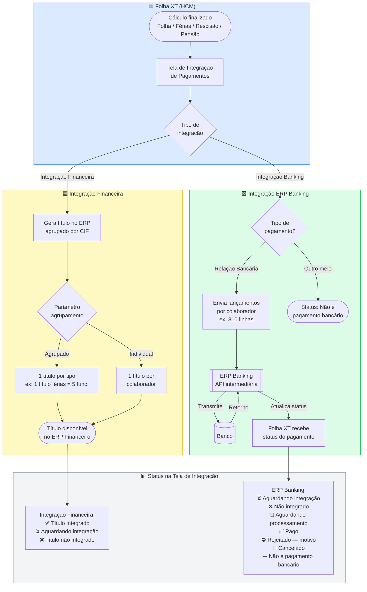

# PRD — Integração Folha XT com ERP Banking

## Metadados do Documento

| Campo | Valor |
|---|---|
| Produto / Módulo | HCM / Folha XT |
| Funcionalidade | Integração com ERP Banking para Transmissão de Arquivos Bancários |
| Tipo | Melhoria / Evolução |
| Linha de Solução | HCM — Gestão de Capital Humano |
| Status | Em Definição |
| Product Owner | [A definir] |
| Stakeholders | Time de Produto HCM, Time ERP Banking, Desenvolvimento |
| Data de criação | 09/04/2026 |
| Última atualização | 09/04/2026 |
| Versão | v0.1 |
| Plataforma | XT |
| IA Embarcada | Não |

---

## 1. Visão do Produto

**O que é?**
A Integração Folha XT com ERP Banking é uma evolução do módulo de pagamentos da Folha XT que conecta diretamente o sistema de folha ao módulo Banking do ERP X, eliminando a necessidade de geração e envio manual de arquivos bancários para pagamento de folha, férias, rescisão e pensão judicial.

**Para quem?**
Analistas e gestores de RH/DP que operam a Folha XT e precisam transmitir arquivos de pagamento aos bancos de forma segura, rastreável e sem retrabalho manual.

**Qual o valor entregue?**
Redução drástica do esforço operacional e do risco de erro humano na transmissão de arquivos bancários, com rastreabilidade completa do status de cada remessa diretamente na Folha XT.

**Resumo executivo:**
Hoje, a Folha XT gera arquivos bancários (CNAB 240/150) que precisam ser exportados manualmente e transmitidos ao banco pelo operador. Esse processo é suscetível a erros, retrabalho e falta de rastreabilidade. O ERP X já possui o módulo Banking, que realiza a conexão direta com os bancos. Esta integração conecta os dois sistemas, permitindo que a Folha XT envie os arquivos de pagamento diretamente ao Banking, que os transmite ao banco. A solução fará parte do pacote de integração Folha XT ↔ ERP X, usando a mesma tecnologia e arquitetura.

---

## 2. Problema e Evidências

### 2.1 Estado Atual (As-Is)

O fluxo atual de pagamento de folha, férias, rescisão e pensão judicial na Folha XT exige que o operador:

1. Calcule a folha/evento no sistema
2. Gere manualmente o arquivo bancário (CNAB 240 ou 150) dentro da Folha XT
3. Faça o download do arquivo para o computador local
4. Envie para o setor responsável por acessar o internet banking ou software do banco
5. A pessoa responsável pelo financeiro faz o upload manual do arquivo no banco
6. Acompanhe o retorno bancário
7. Informa o RH em caso de insucesso

Esse processo é totalmente manual, desconectado e sem rastreabilidade integrada.

### 2.2 Evidências de Dor

| Fonte da Evidência | Descrição |
|---|---|
| Feedback de clientes | Reclamações recorrentes mudanças em leiautes bancários |
| Time de Suporte | Chamados relacionados a erros de layout de arquivo, rejeições bancárias e necessidade de customização |
| Time de Vendas | Perda de oportunidades para concorrentes que oferecem transmissão integrada nativa |
| Dados internos | Alto volume de customizações relacionados aos arquivos CNAB |
| Operação | Risco operacional elevado: arquivo enviado errado, duplicado ou fora do prazo bancário |

### 2.3 Benchmark (Concorrência)

| Concorrente | Funcionalidade Observada |
|---|---|
| **TOTVS (RM / Protheus)** | Integração nativa entre folha e módulo financeiro com geração e transmissão de CNAB 240 diretamente pelo ERP. Suporte a múltiplos bancos com layouts configuráveis. Retorno bancário processado automaticamente. |
| **Senior Sistemas (Senior X)** | Módulo de pagamentos integrado ao HCM com transmissão via API bancária e suporte a CNAB 240. Painel de acompanhamento de remessas e retornos dentro do próprio sistema. |
| **Benner HCM** | Geração de arquivos de pagamento integrada ao fluxo de folha, com envio direto ao banco e conciliação automática de retorno. |
| **Domínio (Thomson Reuters)** | Geração de crédito em conta CNAB 240 integrada ao cálculo de folha, com suporte a múltiplos bancos (BB, Bradesco, Santander, Cresol, etc.) e importação de layouts configuráveis. |

**Oportunidades identificadas:**
- Nenhum concorrente oferece integração nativa entre um módulo HCM e um módulo Banking de ERP como pacote unificado — essa é a diferenciação estratégica desta entrega.
- A arquitetura de pacote de integração (Folha XT ↔ ERP X) cria um ecossistema fechado que aumenta retenção e reduz churn.

---

## 3. Objetivos de Negócio

| # | Objetivo | Métrica Alvo |
|---|---|---|
| O1 | Eliminar o processo manual de transmissão de arquivos bancários | Ter dois cliente pilotos com pagamento 100% via integração, sem geração de arquivo CNAB |
| O2 | Reduzir chamados de suporte relacionados a arquivos bancários | métrica depende da quantidade de clientes que usem o ERP Banking |
| O3 | Aumentar adoção do pacote de integração Folha XT ↔ ERP X | Criar pacote de comercialização do ERP Banking |
| O4 | Reduzir tempo médio do ciclo de pagamento (geração → transmissão) | De ~45 min para < 5 min por evento de pagamento |
| O5 | Aumentar NPS do módulo de pagamentos da Folha XT | Coletar o feedback de 2 pilotos |

---

## 4. Pricing

### 4.1 Custos Envolvidos
- Desenvolvimento da integração (custo interno de engenharia)
- Infraestrutura de API/mensageria entre Folha XT e Banking

### 4.2 Modelos de Precificação Possíveis

| Modelo | Descrição |
|---|---|
| **Bundle** | Incluído no pacote de integração Folha XT ↔ ERP X, com cobrança emutida, sem separação do custo adicional para clientes novos |
| **Add-on** | Módulo de integração bancária como feature adicional com cobrança mensal por número de transações, para clientes de base |

---

## 5. Personas

| Persona | Perfil | Necessidade Principal | Valor Recebido |
|---|---|---|---|
| **Analista de DP** | Profissional responsável pelo processamento da folha, férias, rescisões e pensões. Opera a Folha XT diariamente. | Transmitir arquivos de pagamento ao banco sem sair do sistema, com confirmação de envio | Elimina o processo manual de download/upload de arquivos. Ganha rastreabilidade e segurança no envio |
| **Gestor de RH** | Responsável pela gestão do departamento, acompanha indicadores e aprova processos críticos | Visibilidade do status dos pagamentos e conformidade com prazos bancários | Painel de acompanhamento de remessas com status em tempo real. Reduz risco de atraso no pagamento |
| **Financeiro** | Responsável pelo fluxo financeiro e de pagamento, acesso ao internet banking | Garantir que pagamentos de folha sejam transmitidos com segurança, rastreabilidade e conformidade | Redução da ação humana no fluxo de pagamento de funcionários, garantindo conformidade e redução de riscos |

---

## 6. Estrutura do Produto (Etapas de entregas)

### Etapa 1 — Construção de 
Responsável pelo setup inicial da conexão entre Folha XT e ERP Banking.

Funcionalidades:
- Configuração de credenciais e endpoint do ERP Banking
- Mapeamento de empresas/CNPJs entre Folha XT e Banking
- Configuração de bancos e contas bancárias por empresa
- Definição de tipos de pagamento habilitados (folha, férias, rescisão, pensão judicial)
- Teste de conectividade com o Banking

### Etapa 2 — Configuração da Integração
Responsável pelo setup inicial da conexão entre Folha XT e ERP Banking.

Funcionalidades:
- Configuração de credenciais e endpoint do ERP Banking
- Mapeamento de empresas/CNPJs entre Folha XT e Banking
- Configuração de bancos e contas bancárias por empresa
- Definição de tipos de pagamento habilitados (folha, férias, rescisão, pensão judicial)
- Teste de conectividade com o Banking

### Módulo 2 — Transmissão de Arquivos de Pagamento
Núcleo da integração: envio dos arquivos de pagamento do Folha XT para o Banking.

Funcionalidades:
- Geração do arquivo bancário (CNAB 240) a partir do cálculo de folha/evento
- Envio automático ou sob demanda para o ERP Banking
- Suporte a múltiplos tipos de evento: folha mensal, férias, rescisão, pensão judicial
- Validação prévia do arquivo antes do envio (layout, dados obrigatórios)
- Reenvio de arquivos rejeitados

### Módulo 3 — Acompanhamento e Retorno
Visibilidade do status das remessas e processamento do retorno bancário.

Funcionalidades:
- Painel de status das remessas (enviado, processando, confirmado, rejeitado)
- Recebimento e processamento do arquivo de retorno bancário via Banking
- Atualização automática do status de pagamento na Folha XT
- Notificações de falha ou rejeição
- Histórico de transmissões por empresa/evento/período

### Módulo 4 — Auditoria e Logs
Rastreabilidade completa de todas as operações de transmissão.

Funcionalidades:
- Log de todas as transmissões com user_id, timestamp, tipo de evento e status
- Exportação de relatório de transmissões
- Alertas de falha com detalhamento do erro

---

## 7. Fluxo do Usuário

### 7.0 Diagrama de Fluxo da Informação

### 7.1 Fluxo Principal — Transmissão de Pagamento de Folha (Happy Path)

1. Analista de DP finaliza o cálculo da folha mensal na Folha XT
2. Acessa a **Tela de Integração de Pagamentos**
3. Os registros aparecem automaticamente com status **"Aguardando integração"** nas duas grids (Financeira e Banking)
4. Analista aplica filtros se necessário (período, filial, tipo de cálculo) e revisa os registros e seleciona os registros (com opção de selecionar todos)
5. Aciona o gatilho de **Integração Financeira**: o sistema envia os títulos ao ERP agrupados conforme o parâmetro CIF configurado (agrupado ou individual)
6. Status da grid financeira atualiza para **"Título integrado"**
7. Aciona o gatilho de **Integração Banking**: o sistema envia os lançamentos individuais por colaborador ao ERP Banking (apenas os com tipo de pagamento "relação bancária")
   - Colaboradores com outro tipo de pagamento recebem status **"Não é pagamento bancário"** e não são enviados ao Banking
8. O ERP Banking recebe os lançamentos e os transmite ao banco via API
9. O banco processa e retorna o status ao Banking
10. O Banking repassa o retorno à Folha XT; a grid de Banking atualiza os status por colaborador (**Pago**, **Rejeitado**, **Cancelado**)
11. Em caso de rejeição, o motivo é exibido na grid (ex: agência ou conta errada, CPF errado)

### 7.2 Fluxos Alternativos

- **Rejeição bancária:** Banking retorna status "Rejeitado" com motivo → analista corrige os dados do colaborador e reaciona a integração Banking para o registro específico
- **Falha na integração financeira:** Status atualiza para "Título não integrado" → analista verifica o erro e reprocessa
- **Falha na integração Banking:** Status atualiza para "Não integrado" → analista verifica log de erro e reprocessa
- **Pagamento de férias:** O registro aparece na tela após o cálculo; o analista aciona a integração e a data do pagamento deve ser a data de pagamento configurada na tela de cálculo de férias
- **Pagamento de rescisão:** Registro disponível após cálculo; deve ser integrado integração  e a data do pagamento deve ser a data de pagamento configurada na tela de cálculo de rescisão
- **Pensão judicial:** Aparece na grid de Banking as informações do colaborador e com indicação de pensão (pode ser uma coluna com pensão = S ou N), nome e dados do beneficiário; segue o mesmo fluxo de transmissão
- **Cliente sem ERP Banking:** A grid de Banking não é exibida ou fica desabilitada; apenas a integração financeira está disponível
- **Cliente sem integração financeira:** A grid financeira não é exibida ou fica desabilitada; apenas a integração Banking está disponível
- **Acionamento independente:** O analista pode acionar apenas a integração financeira, apenas a bancária, ou ambas — de forma independente na mesma tela

---

## 8. Requisitos Funcionais

### RF01 — Configuração da Integração com ERP Banking e tela consulta

| Campo | Descrição |
|---|---|
| Descrição | O sistema deve permitir configurar a integração entre a Folha XT e o ERP Banking via parametro para ligar ou desligar a integração. O sistema deve exibir uma tela para consulta e status de todas as transmissões realizadas|
| Regras de Negócio | A configuração deve ser por empresa. Devendo respeitar a abrangência do usuário. A tela deve exibir: empresa, filial, tipo de colaborador, matrícula, nome, tipo de evento, código de cálculo, data do pagamento, data/hora de envio, status (enviado/processando/confirmado/rejeitado), protocolo, usuário que transmitiu. Filtros por filial, código de cálculo, período do pagamento, tipo de evento e status. |
| Dados de Entrada | Filtros de consulta do usuário, local, centro de custo no botão de seleção |
| Dados de Saída | Lista paginada de transmissões com status atualizado |
| Comportamento de Erro | Se a conexão falhar: exibir mensagem de erro e orientação. Assim como no caso de rejeições pelo banco. |
| Dependências | ERP Banking |

### RF02 — Transmissão do Arquivo para o ERP Banking

| Campo | Descrição |
|---|---|
| Descrição | O sistema deve enviar ou disponibilizar as tabelas para o consumo as informações de pagamento para o ERP Banking, de forma segura e com confirmação de recebimento |
| Regras de Negócio | Não deve ser possível transmitir o mesmo arquivo duas vezes sem confirmação de que o pagamento anterior foi cancelado no ERP Banking |
| Dados de Saída | Confirmação de recebimento pelo ERP Banking, status inicial da transmissão (Aguardando processamento) |
| Comportamento de Erro | Timeout ou falha de rede: registrar tentativa no log, exibir alerta e permitir reenvio. Rejeição pelo Banking: exibir motivo e orientação. |

### RF03 — Suporte a Múltiplos Tipos de Evento de Pagamento

| Campo | Descrição |
|---|---|
| Descrição | A integração deve suportar os seguintes tipos de evento: Folha Mensal, adiantamento de 13º salarial, 13º integral, Férias, Rescisão e Pensão Judicial |
| Regras de Negócio | Cada tipo de evento gera um arquivo uma linha de pagamento para o colaborador, de forma que o colaborador que tiver de férias e receber a folha mensal, tenha duas linhas de pagamento, uma para cada tipo. O tipo de evento deve ser identificado. Pensão judicial deve identificar o beneficiário (Nome, CPF e dados bancários do credor). |

### RF04 — Consistência dos Dados Bancários

| Campo | Descrição |
|---|---|
| Descrição | Antes de gerar e transmitir o arquivo, o sistema deve consistir se o colaborador está com tipo de pagamento R - Relação bancária e possui dados bancários |
| Regras de Negócio | Campos obrigatórios: No cadastro do colaborador (R034FUN) há o assinalamento e o dado da conta bancária. Nos casos de ter o histórico de conta ativa, garantir que seja usado a conta mais recente e quando houver percentual, garantir que seja gerado os valores separados, uma linha para cada banco, com o percentual indicado no histórico, de forma que os pagamentos gerados estejam em 100% (Nem mais nem menos) e que sejam as contas da sequência mais recente. |
| Comportamento de Erro | Bloquear transmissão se houver pendências. Exibir log com a pendência. |

### RF05 — Processamento do Retorno Bancário

| Campo | Descrição |
|---|---|
| Descrição | O sistema deve receber o status de retorno do processamento bancário via ERP Banking e atualizar automaticamente o status dos pagamentos na Folha XT |
| Regras de Negócio | O retorno deve ser processado automaticamente quando disponibilizado pelo Banking. Cada registro do retorno deve ser conciliado com o colaborador correspondente. Status possíveis: confirmado, rejeitado, cancelado. |
| Comportamento de Erro | Registros rejeitados: registrar no log o motivo da rejeição. Registro cancelado: esse status deve ser apresentado quando houver um cancelamento manual no internet Banking (antes do envio para o banco)|

### RF06 — Reenvio de Arquivo Rejeitado

| Campo | Descrição |
|---|---|
| Descrição | O sistema deve permitir o reenvio de um arquivo que foi rejeitado pelo banco ou pelo Banking, após correção dos dados |
| Regras de Negócio | Apenas arquivos com status "rejeitado" podem ser reenviados. O reenvio deve gerar uma nova pendência. O histórico do envio original deve ser preservado com o status "Retransmitido". |
| Dados de Entrada | Seleção do registro rejeitado no painel de acompanhamento |
| Dados de Saída | Novo protocolo de envio, status atualizado |
| Comportamento de Erro | Se o evento já tiver sido confirmado por outro envio: bloquear reenvio e exibir alerta |
| Dependências | RF06, RF03 |
| Prioridade | Must |

### RF09 — Notificações de Status de Transmissão

| Campo | Descrição |
|---|---|
| Descrição | O sistema deve notificar o usuário sobre eventos críticos de transmissão: falha de envio, rejeição bancária e confirmação de pagamento |
| Regras de Negócio | Notificações in-app obrigatórias. Notificação por e-mail opcional (configurável). Notificar o usuário que realizou a transmissão e o gestor configurado. |
| Dados de Entrada | Eventos de status retornados pelo Banking |
| Dados de Saída | Notificação in-app e/ou e-mail com detalhes do evento |
| Comportamento de Erro | Falha no envio de e-mail: registrar no log, não bloquear o fluxo principal |
| Dependências | RF03, RF07 |
| Prioridade | Should |

### RF10 — Trilha de Auditoria das Transmissões

| Campo | Descrição |
|---|---|
| Descrição | Todas as ações relacionadas à transmissão bancária devem ser registradas em trilha de auditoria imutável |
| Regras de Negócio | Registrar: user_id, nome do usuário, empresa, tipo de evento, competência, data/hora, ação realizada (geração, envio, reenvio, processamento de retorno), status resultante, protocolo Banking |
| Dados de Entrada | Eventos do sistema (automáticos) |
| Dados de Saída | Log de auditoria consultável por administradores |
| Comportamento de Erro | Falha no registro de auditoria deve gerar alerta crítico para o time de TI |
| Dependências | Todos os RFs de transmissão |
| Prioridade | Must |

---

## 9. Requisitos Não Funcionais

| ID | Categoria | Requisito |
|---|---|---|
| RNF01 | Performance | Transmissão de arquivo para o Banking deve ser concluída em < 10 segundos para arquivos com até 5.000 registros |
| RNF02 | Performance | Painel de acompanhamento deve carregar em < 2 segundos para consultas de até 90 dias |
| RNF03 | Disponibilidade | A integração deve ter disponibilidade de 99,5% nos dias úteis entre 06h e 22h (janela de transmissão bancária) |
| RNF04 | Segurança | Comunicação entre Folha XT e Banking via HTTPS/TLS 1.2+. Credenciais armazenadas com criptografia AES-256. |
| RNF05 | Segurança | Controle de acesso por perfil: apenas usuários com permissão explícita podem transmitir arquivos |
| RNF06 | Auditoria | Log imutável de todas as ações com user_id, timestamp e detalhes da operação (LGPD e auditoria interna) |
| RNF07 | Escalabilidade | Suportar processamento de arquivos com até 50.000 registros sem degradação de performance |
| RNF08 | Responsividade | Interface desktop responsiva, compatível com resoluções a partir de 1280x768 |
| RNF09 | Compatibilidade | Compatível com os principais navegadores: Chrome, Edge e Firefox (últimas 2 versões) |
| RNF10 | Resiliência | Em caso de falha de comunicação com o Banking, o sistema deve implementar retry automático com backoff exponencial (máx. 3 tentativas) |
| RNF11 | Rastreabilidade | Cada transmissão deve ter um identificador único (UUID) para correlação entre Folha XT, Banking e banco |
| RNF12 | Manutenibilidade | Layouts CNAB devem ser configuráveis sem necessidade de deploy (parametrização via interface ou arquivo de configuração) |

---

## 10. Compliance, LGPD e Requisitos Legais

### 10.1 Dados Sensíveis Envolvidos

| Dado | Classificação LGPD | Onde é Utilizado |
|---|---|---|
| CPF do colaborador | Dado pessoal | Header e registros do CNAB |
| Nome completo | Dado pessoal | Registros do CNAB |
| Salário / valor líquido | Dado pessoal sensível (financeiro) | Registros de pagamento do CNAB |
| Dados bancários (agência, conta) | Dado pessoal | Registros do CNAB |
| CPF do beneficiário de pensão judicial | Dado pessoal | Registros de pensão judicial |
| Dados do credor de pensão judicial | Dado pessoal | Registros de pensão judicial |

### 10.2 Requisitos de Conformidade

| Requisito | Descrição |
|---|---|
| Trilha de auditoria (LGPD Art. 37) | Todos os acessos e transmissões de dados pessoais devem ser registrados com user_id, employee_id, timestamp e finalidade |
| Minimização de dados | O arquivo CNAB deve conter apenas os dados estritamente necessários para o pagamento bancário |
| Controle de acesso | Apenas usuários com permissão explícita podem visualizar dados bancários e transmitir arquivos |
| Retenção de dados | Logs de transmissão devem ser retidos por no mínimo 5 anos (conformidade trabalhista e fiscal) |
| Criptografia em trânsito | Todos os dados transmitidos entre Folha XT e Banking devem ser criptografados (TLS 1.2+) |
| Criptografia em repouso | Credenciais de integração e dados bancários armazenados com criptografia AES-256 |
| Fidelidade legal | O arquivo CNAB deve seguir rigorosamente o padrão FEBRABAN CNAB 240, garantindo conformidade com as normas bancárias brasileiras |
| Pensão judicial | Pagamentos de pensão judicial devem seguir as determinações da ordem judicial correspondente (valor, beneficiário, banco) |

---

## 11. Entregáveis

| Componente | Descrição da Entrega |
|---|---|
| Interface (UI) | Tela de configuração da integração (HCM > Folha XT > Configurações > Integração Banking) |
| Interface (UI) | Tela de transmissão bancária por tipo de evento (Folha, Férias, Rescisão, Pensão Judicial) |
| Interface (UI) | Painel de acompanhamento de transmissões com filtros e status em tempo real |
| Interface (UI) | Tela de detalhamento de transmissão (protocolo, registros, retorno bancário) |
| Backend / API | Serviço de integração Folha XT ↔ ERP Banking (geração de CNAB, envio via API, processamento de retorno) |
| Backend / API | Endpoint de webhook/callback para recebimento de retorno do Banking |
| Backend / API | Motor de validação de dados bancários (pré-transmissão) |
| Auditoria | Módulo de log imutável de transmissões |
| Notificações | Sistema de notificações in-app para eventos críticos de transmissão |
| Documentação | Documentação técnica da API de integração (para o time de Banking e implantadores) |
| Documentação | Manual do usuário (help online) para o fluxo de transmissão bancária |
| Documentação | Release notes e material de treinamento para CS e clientes |

---

## 12. Cenários de Teste (QA)

### 12.1 Cenários Positivos (Happy Path)

| # | Cenário | Descrição / Condições | Resultado Esperado |
|---|---|---|---|
| C01 | Transmissão de folha mensal | Folha calculada e aprovada, todos os colaboradores com dados bancários completos, integração configurada | Arquivo CNAB 240 gerado e transmitido ao Banking com sucesso. Status "Enviado para Banking" exibido com protocolo. |
| C02 | Transmissão de férias | Evento de férias calculado, colaborador com dados bancários válidos | Arquivo CNAB 240 de férias gerado e transmitido. Tipo de evento identificado corretamente no header do arquivo. |
| C03 | Transmissão de rescisão | Rescisão calculada e homologada, dados bancários do colaborador válidos | Arquivo CNAB 240 de rescisão transmitido com sucesso. |
| C04 | Transmissão de pensão judicial | Pensão judicial configurada com dados do beneficiário e credor | Arquivo CNAB 240 com dados do credor transmitido corretamente. |
| C05 | Processamento de retorno bancário | Banking envia arquivo de retorno com confirmação de pagamento | Status dos colaboradores atualizado para "Confirmado pelo Banco". Painel de acompanhamento reflete o retorno. |
| C06 | Reenvio após rejeição | Arquivo rejeitado pelo banco, dados corrigidos pelo analista | Reenvio gera novo protocolo. Histórico do envio original preservado. Novo status atualizado. |
| C07 | Consulta no painel de acompanhamento | Analista filtra transmissões por empresa, período e tipo de evento | Lista paginada exibida corretamente com todos os campos (protocolo, status, data, usuário). |
| C08 | Configuração da integração | Administrador configura endpoint e credenciais do Banking | Teste de conectividade bem-sucedido. Configuração salva. Status da integração exibido como "Ativa". |

### 12.2 Cenários Negativos (Edge Cases)

| # | Cenário | Descrição / Condições | Resultado Esperado |
|---|---|---|---|
| C09 | Dados bancários incompletos | Folha calculada, mas 3 colaboradores sem agência bancária cadastrada | Sistema bloqueia transmissão e exibe relatório listando os 3 colaboradores com pendência. |
| C10 | Falha de conectividade com Banking | Endpoint do Banking indisponível no momento da transmissão | Sistema exibe alerta de falha, registra tentativa no log, executa retry automático (3x). Após falhas, permite reenvio manual. |
| C11 | Tentativa de dupla transmissão | Analista tenta transmitir o mesmo arquivo já confirmado | Sistema bloqueia e exibe alerta: "Este evento já foi transmitido e confirmado. Deseja reenviar?" |
| C12 | Usuário sem permissão | Usuário sem perfil de transmissão tenta acessar a tela de transmissão bancária | Acesso bloqueado. Mensagem: "Você não tem permissão para realizar transmissões bancárias." |
| C13 | Arquivo de retorno inválido | Banking envia arquivo de retorno com layout incorreto | Sistema registra erro no log, notifica o administrador e mantém status anterior dos pagamentos. |
| C14 | Credenciais de integração inválidas | Administrador salva configuração com credenciais incorretas | Teste de conectividade falha. Mensagem de erro com código HTTP. Configuração não é salva. |
| C15 | Folha não finalizada | Analista tenta transmitir folha com cálculo em andamento | Sistema bloqueia e exibe: "O cálculo da folha deve estar finalizado e aprovado para transmissão." |
| C16 | Timeout na transmissão | Arquivo grande (50.000 registros) com latência elevada | Sistema aguarda até o timeout configurado, registra no log e exibe status "Aguardando confirmação do Banking". |

---

## 13. Dependências e Integrações

### 13.1 Dependências Internas

| Dependência | Tipo | Descrição |
|---|---|---|
| Módulo de Cálculo de Folha (Folha XT) | Dados | O cálculo deve estar finalizado e aprovado para que a transmissão seja habilitada |
| Cadastro de Colaboradores (Folha XT) | Dados | Dados bancários, CPF e nome dos colaboradores devem estar cadastrados e validados |
| Módulo de Férias (Folha XT) | Dados | Evento de férias calculado e aprovado |
| Módulo de Rescisão (Folha XT) | Dados | Rescisão calculada e homologada |
| Módulo de Pensão Judicial (Folha XT) | Dados | Dados do beneficiário e credor configurados |
| Módulo de Permissões (Folha XT) | Serviço | Controle de acesso por perfil para as funcionalidades de transmissão |
| ERP Banking (ERP X) | Serviço | Módulo que realiza a conexão direta com os bancos e transmite os arquivos CNAB |

### 13.2 Integrações Externas

| Sistema / API | Tipo | Descrição |
|---|---|---|
| ERP Banking — API de Transmissão | API REST | Endpoint para envio do arquivo CNAB 240 e recebimento de protocolo |
| ERP Banking — Webhook de Retorno | Webhook/Callback | Notificação de status de processamento bancário (confirmado/rejeitado) |
| Bancos (via Banking) | Indireto | A Folha XT não se conecta diretamente aos bancos; a conexão é intermediada pelo ERP Banking |
| Padrão FEBRABAN CNAB 240 | Regulatório | Layout obrigatório para arquivos de pagamento bancário no Brasil |

---

## 14. Riscos e Mitigações

| # | Risco | Impacto | Probabilidade | Mitigação |
|---|---|---|---|---|
| R1 | API do ERP Banking não estar disponível ou documentada no prazo | Alto | Média | Alinhar com o time de Banking o contrato de API e cronograma de disponibilização antes do início do desenvolvimento |
| R2 | Divergência de layout CNAB entre o gerado pela Folha XT e o esperado pelo banco | Crítico | Média | Validar layouts com pelo menos 3 bancos principais (BB, Bradesco, Itaú) em ambiente de homologação antes do release |
| R3 | Falha silenciosa na transmissão (arquivo enviado mas não processado pelo banco) | Crítico | Baixa | Implementar confirmação de recebimento pelo Banking + processamento de retorno bancário obrigatório |
| R4 | Escopo crescente (solicitação de novos tipos de evento ou bancos durante o desenvolvimento) | Médio | Alta | Definir escopo fechado para v1.0 (4 tipos de evento). Novos bancos/eventos entram em backlog para v1.1 |
| R5 | Dados bancários desatualizados dos colaboradores gerando rejeições em massa | Alto | Média | Implementar validação prévia robusta (RF05) e relatório de pendências antes da transmissão |
| R6 | Impacto em performance para empresas com grande volume de colaboradores (>10.000) | Alto | Baixa | Implementar processamento assíncrono para arquivos grandes + paginação no painel |
| R7 | Resistência dos usuários à mudança de processo (abandono do fluxo manual) | Médio | Média | Treinamento, material de apoio e acompanhamento de adoção pelo CS nos primeiros 90 dias |
| R8 | Não conformidade com LGPD no tráfego de dados pessoais entre sistemas | Crítico | Baixa | Revisão de compliance antes do release, criptografia em trânsito e repouso, trilha de auditoria completa |

---

## 15. Métricas de Sucesso

| Métrica | Baseline (Atual) | Meta | Prazo de Medição |
|---|---|---|---|
| % de transmissões realizadas via integração (vs. manual) | 0% | 80% dos clientes com ambos os produtos | 3 meses após release |
| Tempo médio do ciclo geração → transmissão | ~45 minutos | < 5 minutos | 1 mês após release |
| Volume de chamados de suporte relacionados a CNAB/transmissão | [Baseline a levantar com CS] | -50% | 6 meses após release |
| Taxa de rejeição bancária por dados incorretos | [Baseline a levantar] | < 2% das transmissões | 3 meses após release |
| Adoção do pacote de integração Folha XT ↔ ERP X | 0% | 30% da base elegível | 6 meses após release |
| NPS do módulo de pagamentos da Folha XT | [Baseline a levantar] | +15 pontos | 3 meses após release |

---

## 16. Plano de Execução (Roadmap)

### Fase 1 — Discovery e Definição
- PRD finalizado e aprovado pelos stakeholders
- Contrato de API com o time de ERP Banking definido
- Protótipo de alta fidelidade das telas (configuração, transmissão, painel)
- Validação de layouts CNAB com bancos parceiros
- Duração estimada: 2 sprints

### Fase 2 — Desenvolvimento
- Backend: serviço de integração, geração de CNAB, motor de validação, processamento de retorno
- Frontend: telas de configuração, transmissão e painel de acompanhamento
- Módulo de auditoria e notificações
- Duração estimada: 4 sprints

### Fase 3 — QA e Homologação
- Execução dos cenários de teste (positivos e negativos)
- Testes de integração com o ERP Banking em ambiente de homologação
- Testes de performance (arquivos com 5.000 e 50.000 registros)
- Validação de layouts CNAB com bancos reais (sandbox bancário)
- Duração estimada: 2 sprints

### Fase 4 — Release e Acompanhamento
- Deploy em produção (rollout gradual por grupo de clientes)
- Treinamento do time de CS e clientes piloto
- Monitoramento de métricas de adoção e performance
- Coleta de feedback e ajustes pós-release
- Duração estimada: 1 sprint + 90 dias de acompanhamento

---

## 17. Glossário e Referências

| Termo / Sigla | Definição |
|---|---|
| CNAB | Centro Nacional de Automação Bancária — padrão de layout de arquivos bancários definido pela FEBRABAN |
| CNAB 240 | Layout CNAB com registros de 240 posições, padrão para pagamentos em lote |
| FEBRABAN | Federação Brasileira de Bancos — define os padrões de arquivos bancários no Brasil |
| Banking (ERP X) | Módulo do ERP X responsável pela conexão direta com bancos e transmissão de arquivos bancários |
| Folha XT | Sistema de gestão de folha de pagamento da linha HCM |
| HCM | Human Capital Management — linha de produtos de gestão de capital humano |
| ERP X | Plataforma ERP com a qual a Folha XT está sendo integrada |
| Remessa | Arquivo bancário enviado pela empresa ao banco para processamento de pagamentos |
| Retorno | Arquivo bancário enviado pelo banco à empresa confirmando ou rejeitando os pagamentos |
| Pensão Judicial | Desconto em folha determinado por ordem judicial, repassado ao beneficiário via arquivo bancário |
| LGPD | Lei Geral de Proteção de Dados (Lei nº 13.709/2018) |
| TLS | Transport Layer Security — protocolo de criptografia para comunicação segura |
| OAuth | Protocolo de autorização para autenticação segura entre sistemas |
| MoSCoW | Método de priorização: Must have, Should have, Could have, Won't have |

**Referências:**
- Padrão FEBRABAN CNAB 240: https://www.febraban.org.br/
- Lei Geral de Proteção de Dados (LGPD): https://www.planalto.gov.br/ccivil_03/_ato2015-2018/2018/lei/l13709.htm
- Documentação API ERP Banking: [A ser fornecida pelo time de Banking]
- Layouts CNAB por banco: [A ser fornecida pelo time de Banking]

---

## 18. Histórico de Versões

| Versão | Data | Autor | Alterações |
|---|---|---|---|
| v0.1 | 09/04/2026 | [Product Owner] | Criação do documento |
